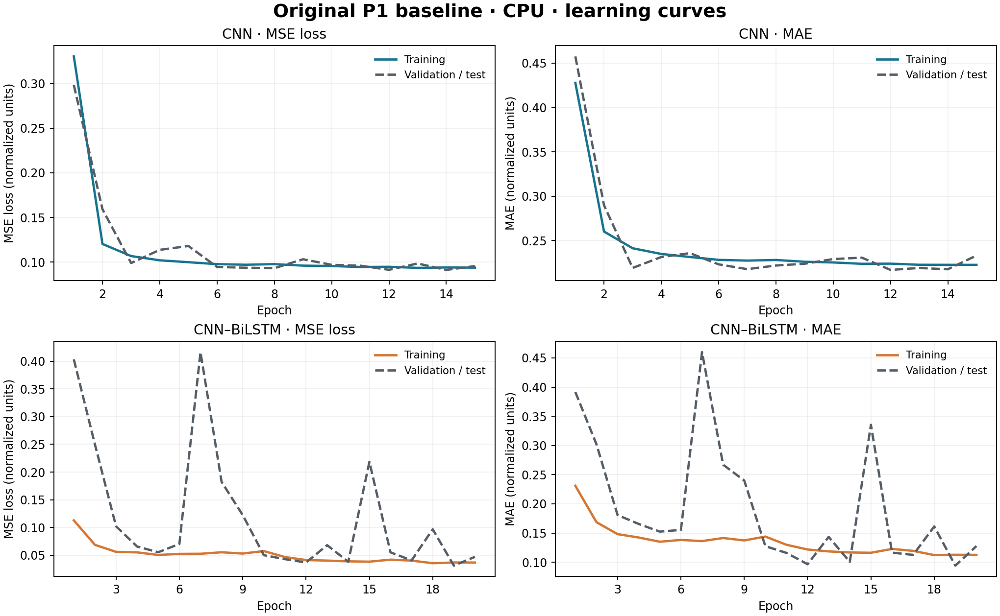
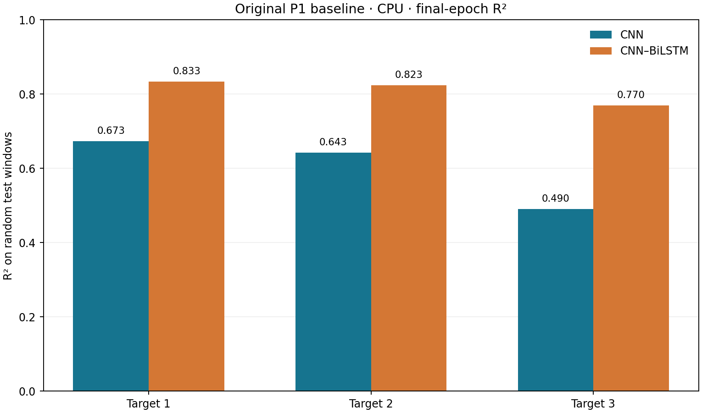
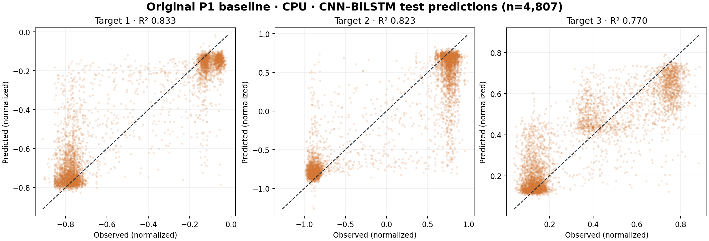

# Original P1 baseline — Native Windows CPU

The existing notebook trained its CNN for 15 epochs and CNN–BiLSTM for 20 epochs on subject P1. The model definitions, whole-record normalization, 128-sample windows, 64-sample stride, and random 80/20 split were unchanged. Both models used the same 4,807 test windows.

Environment: Python 3.9.13, TensorFlow 2.20.0, NumPy 2.0.2, SciPy 1.13.1, scikit-learn 1.6.1.

| Model | Training time | Target | MSE | MAE | R² |
|---|---:|---:|---:|---:|---:|
| CNN | 259.86 s | 1 | 0.034433 | 0.151044 | 0.672977 |
| CNN | 259.86 s | 2 | 0.217777 | 0.388451 | 0.642745 |
| CNN | 259.86 s | 3 | 0.034470 | 0.160217 | 0.489926 |
| CNN–BiLSTM | 272.34 s | 1 | 0.017540 | 0.086224 | 0.833413 |
| CNN–BiLSTM | 272.34 s | 2 | 0.107762 | 0.206067 | 0.823221 |
| CNN–BiLSTM | 272.34 s | 3 | 0.015569 | 0.090843 | 0.769613 |

The values use normalized target units. The three target columns have not been matched to named sensors, so they are identified only by number. Training time measures `model.fit`, including validation and initial compilation.

## Plots

Training and validation/test loss and MAE by epoch. The same held-out windows served as validation throughout training.

Final-epoch R² for both models, calculated separately for each target.

Each point represents one randomly selected test window; the dashed line is perfect prediction. The horizontal bands reflect the fitted outputs and should not be read as a continuous movement trace.

## Interpretation and files

The CNN–BiLSTM has higher R² than the CNN on all three targets in this run. These scores are an original-pipeline reproduction: overlapping windows were randomly split, normalization used the full recording before the split, and the test set was reused for validation. They do not establish performance on independent recording series or unseen subjects. The model training is unseeded, so CPU/GPU score differences do not measure a hardware effect.

`results.json` contains the complete epoch histories, metrics, package versions, and device detection. Private local artifacts such as model weights, raw prediction arrays, notebook snapshots, and logs are excluded from Git. See [baseline methods and limitations](../../documentation/ORIGINAL_BASELINE.md).
