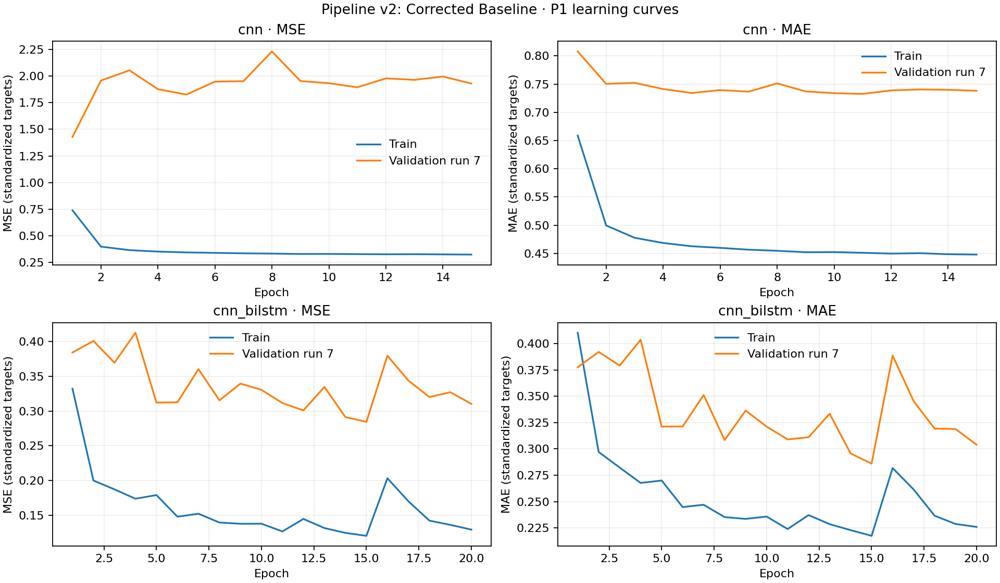
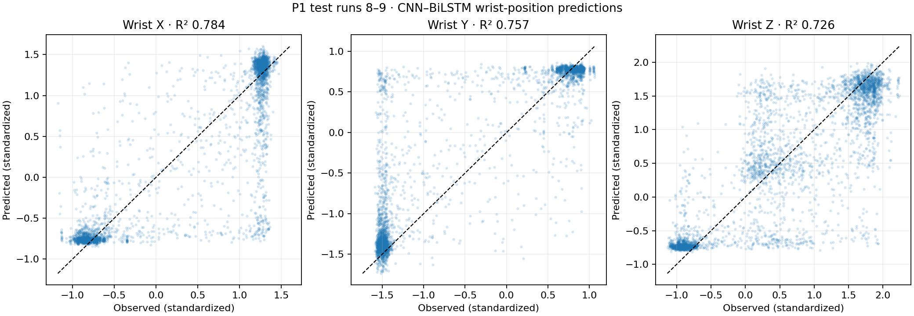

# Pipeline v2: Corrected Baseline — P1 GPU

Train runs 1–6; validation run 7; held-out test runs 8–9. The test runs contain friction condition 3 only.
Models and epoch counts match the original notebook. EEG and targets were standardized separately using training runs only.

| Model | Training seconds | Wrist axis | MSE | MAE | R² |
|---|---:|---:|---:|---:|---:|
| cnn | 34.24 | Wrist X | 0.428290 | 0.552413 | 0.546620 |
| cnn | 34.24 | Wrist Y | 0.677749 | 0.702901 | 0.399390 |
| cnn | 34.24 | Wrist Z | 0.679007 | 0.669690 | 0.451098 |
| cnn_bilstm | 170.83 | Wrist X | 0.203893 | 0.251033 | 0.784162 |
| cnn_bilstm | 170.83 | Wrist Y | 0.274143 | 0.285369 | 0.757058 |
| cnn_bilstm | 170.83 | Wrist Z | 0.338661 | 0.400155 | 0.726230 |

### Results by held-out run

| Model | Run | Windows | R² wrist X | R² wrist Y | R² wrist Z |
|---|---:|---:|---:|---:|---:|
| cnn | 8 | 1832 | 0.5667 | 0.4282 | 0.4506 |
| cnn | 9 | 1810 | 0.5271 | 0.3721 | 0.4511 |
| cnn_bilstm | 8 | 1832 | 0.8131 | 0.7870 | 0.7320 |
| cnn_bilstm | 9 | 1810 | 0.7562 | 0.7288 | 0.7204 |

The second test run is slightly weaker on all three targets for the CNN–BiLSTM. Both runs use friction condition 3.
The CNN validation loss on run 7 remains much higher than its training loss at the final epoch; a single validation run may be unstable, so the next evaluation should repeat the holdout across runs.

MSE and MAE use standardized target units. The three target columns are wrist X/Y/Z; see [kinematics provenance](../../documentation/KINEMATICS_PROVENANCE.md).
Random windows from the original baseline and these held-out runs measure different tasks; compare their protocols before comparing scores.
Model weights and raw predictions are local artifacts excluded from Git.

[Pipeline changes and limitations](../../documentation/PIPELINE_V2_CORRECTED_BASELINE.md).
