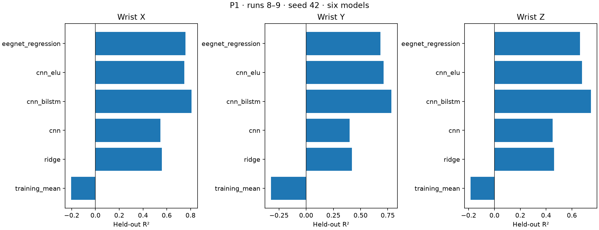
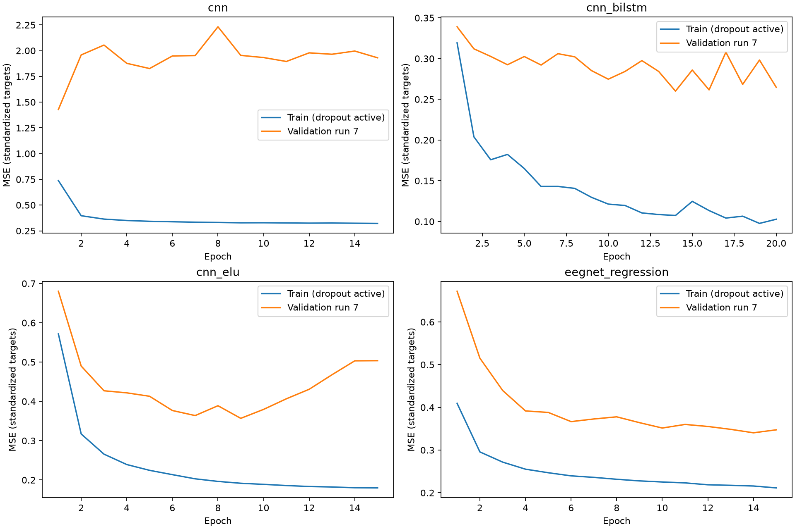

# Six-model comparison — P1

Train runs 1–6; validation run 7; test runs 8–9. Same v2 train-only scaling and 128-sample/stride-64 windows for every model.
Four neural models trained on the GPU; mean and ridge on CPU. Neural seed 42; fixed final epochs (CNN variants 15, CNN–BiLSTM 20).

| Model | Parameters | Fit seconds | R² X | R² Y | R² Z |
|---|---:|---:|---:|---:|---:|
| training_mean | 3 | 0.00 | -0.2044 | -0.3242 | -0.1847 |
| ridge | 12291 | 20.28 | 0.5581 | 0.4203 | 0.4616 |
| cnn | 3235 | 31.39 | 0.5466 | 0.3994 | 0.4511 |
| cnn_bilstm | 61347 | 140.62 | 0.8092 | 0.7830 | 0.7484 |
| cnn_elu | 3235 | 31.67 | 0.7465 | 0.7126 | 0.6775 |
| eegnet_regression | 1891 | 27.09 | 0.7577 | 0.6830 | 0.6628 |

Ridge alpha 100 was selected from 1, 10, 100, 1000, 10000 using validation MSE only.
ELU-only CNN adds two activations, keeping the original weights' initialization, pooling, dropout, capacity and schedule.
EEGNet regression follows the authors' feature extractor with a linear three-axis head: ELU, 4× then 8× pooling, dropout 0.5, and max-norm constraints.
Its 1,891 parameters differ from the 3,235-parameter CNN. It preserves sample-based kernels; sampling-rate retuning was not performed.

## Held-out runs separately

| Model | Run | R² X | R² Y | R² Z |
|---|---:|---:|---:|---:|
| training_mean | 8 | -0.2189 | -0.3410 | -0.2080 |
| training_mean | 9 | -0.1906 | -0.3084 | -0.1631 |
| ridge | 8 | 0.5630 | 0.4408 | 0.4603 |
| ridge | 9 | 0.5533 | 0.4010 | 0.4624 |
| cnn | 8 | 0.5667 | 0.4282 | 0.4506 |
| cnn | 9 | 0.5271 | 0.3721 | 0.4511 |
| cnn_bilstm | 8 | 0.8290 | 0.8021 | 0.7597 |
| cnn_bilstm | 9 | 0.7900 | 0.7649 | 0.7373 |
| cnn_elu | 8 | 0.7834 | 0.7652 | 0.6870 |
| cnn_elu | 9 | 0.7107 | 0.6629 | 0.6680 |
| eegnet_regression | 8 | 0.7961 | 0.7349 | 0.6672 |
| eegnet_regression | 9 | 0.7206 | 0.6339 | 0.6581 |

Single participant and seed; test friction condition 3 only. This does not establish cross-participant generalization or statistical significance.
Positive/negative R² is relative to the test mean; the training-mean baseline can therefore have negative R².
MSE and MAE use standardized targets; complete values and validation selection are in results.json.
Saved neural models were reloaded for test inference; saved prediction metrics were recomputed successfully.
Original notebooks and historical results are preserved. Model weights, predictions and notebook snapshots remain local.
